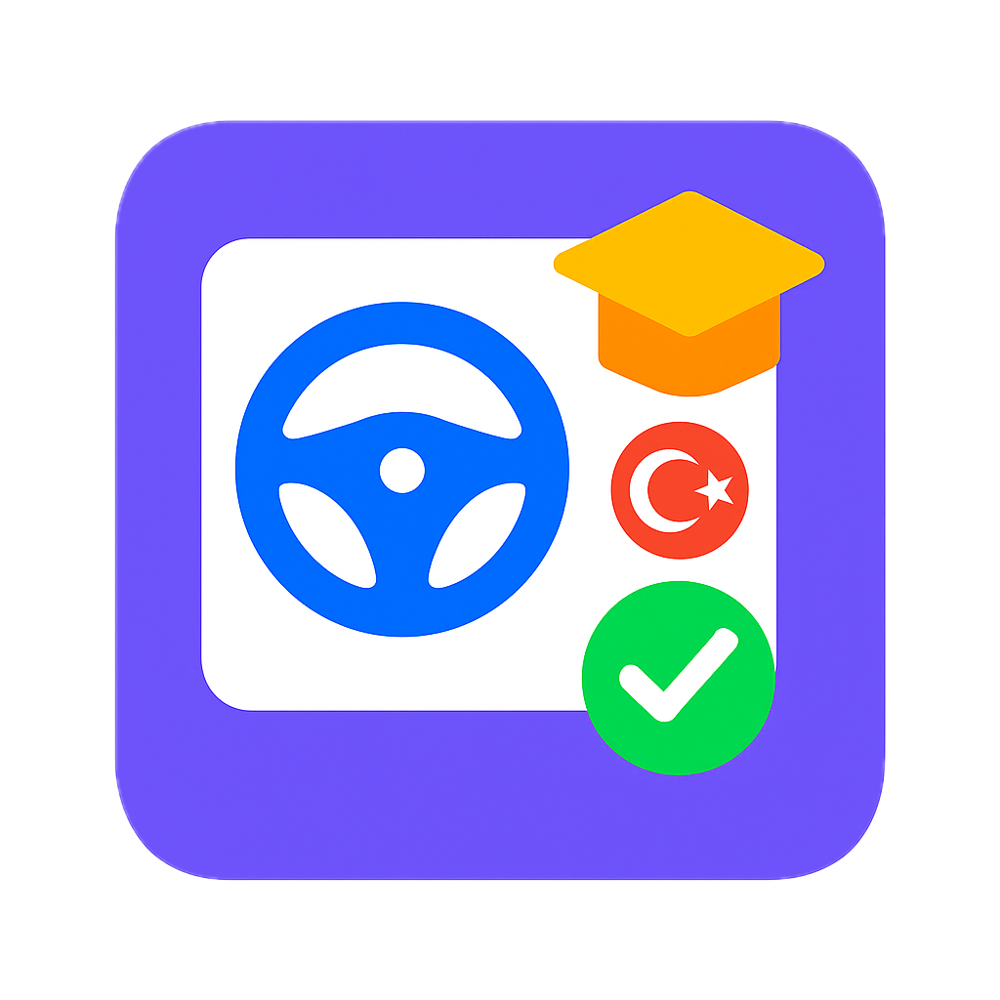
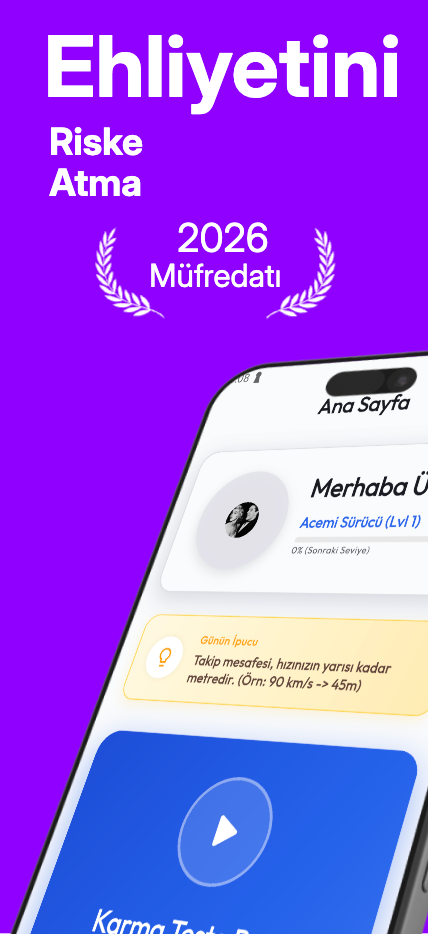
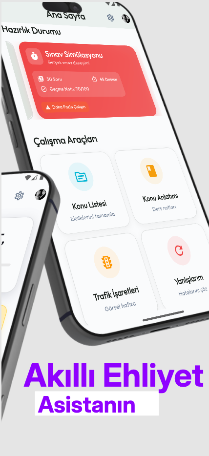
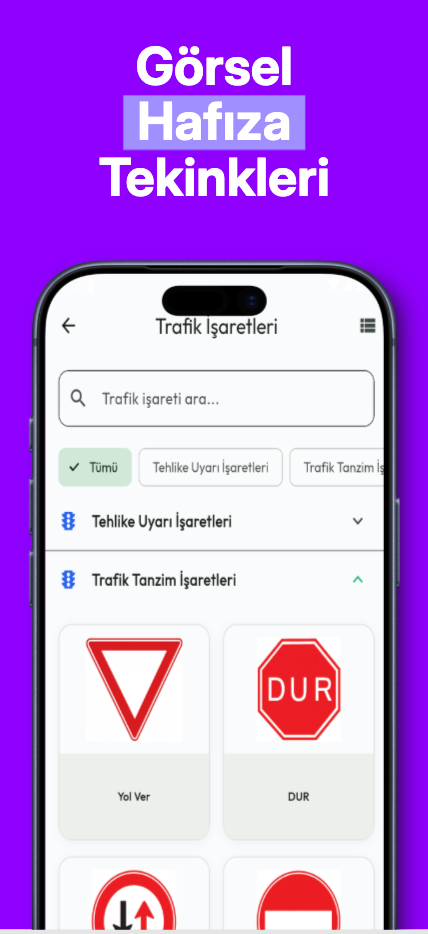
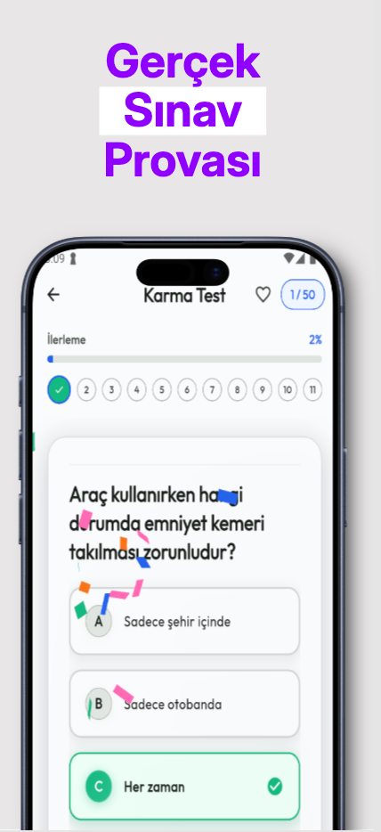
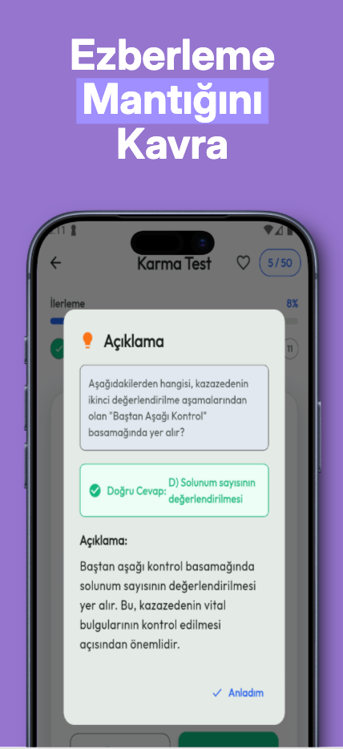
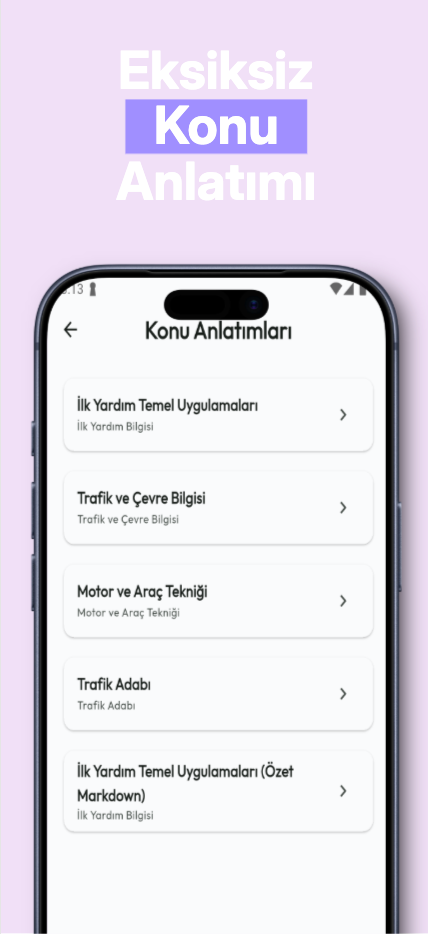
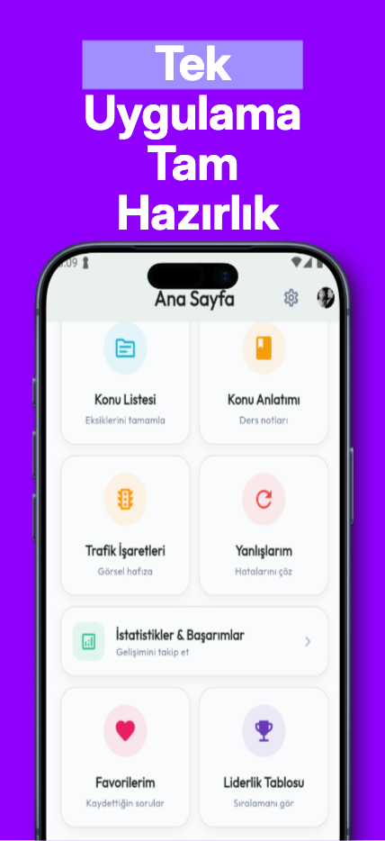

#  Ehliyet Rehberim


[🇹🇷 Türkçe Oku](README.tr.md)

Ehliyet Rehberim is a comprehensive mobile application engineered to facilitate preparation for the Turkish Driver's License Exam. It integrates advanced performance analytics, visual mnemonic techniques, and real-time state management to deliver an optimized learning experience.

## Overview

The application serves as a robust educational platform, offering over 20 simulation exams, detailed subject explanations, and interactive quizzes. It utilizes a feature-first architecture to ensure scalability and maintainability, leveraging Riverpod for state management and Firebase for backend services including authentication and data persistence.

## Architecture & Design

This project adheres to a **Feature-First Architecture**, promoting separation of concerns and modularity. Each feature is self-contained with its own Domain, Data, and Presentation layers, ensuring that business logic is decoupled from UI components.

### Core Principles
*   **Layered Architecture**: Strict separation between Data, Domain, and Presentation layers.
*   **Reactive State Management**: Utilizes `flutter_riverpod` for dependency injection and state management.
*   **Repository Pattern**: Abstracts data sources to provide a clean API for the domain layer.
*   **Clean Code**: Emphasizes readability, testability, and SOLID principles.

## Use Cases & Features

*   **Exam Simulation**: 20+ full-length practice exams mimicking real-world testing conditions.
*   **Performance Analytics**: `fl_chart` implementation for visualizing user progress and identifying weak areas.
*   **Visual Learning Modules**: Specialized interactive components for traffic signs and vehicular technical knowledge.
*   **State Persistence**: `shared_preferences` and local caching strategies for offline capability.
*   **Secure Authentication**: Integrated Firebase Auth supporting Email, Google, and Apple Sign-In providers.

## Technology Stack

| Component | Technology | Description |
| :--- | :--- | :--- |
| **Framework** | Flutter 3.8.1+ | UI toolkit for building natively compiled applications. |
| **Language** | Dart | Optimized for UI logic and asynchronous programming. |
| **State Management** | Riverpod | Compile-safe state management and dependency injection. |
| **Backend** | Firebase | Serverless backend for Auth, Firestore, and Analytics. |
| **Local Storage** | SharedPreferences | Key-value store for user settings and lightweight data. |
| **Visualization** | FL Chart | Library for rendering complex and interactive charts. |
| **Typography** | Google Fonts | Implementation of the `Inter` font family for consistent typography. |

## Project Structure

The directory structure reflects the feature-first approach:

```
lib/
├── src/
│   ├── features/               # Feature-specific modules
│   │   ├── auth/               # Authentication (Login, Register, AuthGate)
│   │   ├── home/               # Dashboard and core navigation logic
│   │   ├── quiz/               # Exam engine, state management, and UI
│   │   ├── stats/              # Data visualization and progress tracking
│   │   ├── profile/            # User settings and profile management
│   │   └── favorites/          # Bookmarking system for questions
│   ├── common_widgets/         # Shared UI components (Buttons, Inputs, Cards)
│   ├── constants/              # Application-wide constants (Colors, Strings)
│   ├── utils/                  # Utility classes, formatters, and extensions
│   ├── routing/                # Router configuration and paths
│   └── localization/           # Internationalization resources
└── main.dart                   # Application entry point and verified initialization
```

## Getting Started

### Prerequisites
*   Flutter SDK: `>=3.8.1`
*   Dart SDK: Compatible with Flutter version
*   CocoaPods (for iOS build)

### Installation

1.  **Clone the Repository**
    ```bash
    git clone https://github.com/Start-Up-Academy-Mobile-App/ehliyet-rehberim.git
    cd ehliyet-rehberim
    ```

2.  **Install Dependencies**
    ```bash
    flutter pub get
    ```

3.  **Firebase Configuration**
    *   Place `google-services.json` in `android/app/`.
    *   Place `GoogleService-Info.plist` in `ios/Runner/`.

4.  **Run Application**
    ```bash
    flutter run
    ```

## Screenshots

| Onboarding 1 | Onboarding 2 | Screen 1 |
|:---:|:---:|:---:|
|  |  |  |
| **Screen 2** | **Screen 3** | **Screen 4** |
|  |  |  |
| **Screen 5** | | |
|  | | |

## License

This project is licensed under the MIT License - see the [LICENSE](LICENSE) file for details.
